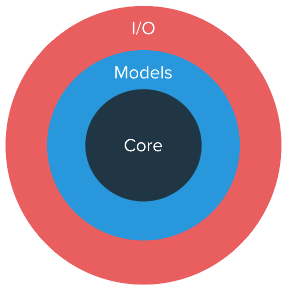

# Disolv Crates

Simulator is divided into multiple crates to enable modular design.
An onion-like layered design is incorporated with crates arranged in an hierarchical manner.

<!--  -->

  

### Core

_disolv-core_ crate is the innermost layer of the simulator. 
This is independent of all the other Disolv crates.
_disolv-core_ contains the declarations and definitions that are used throughout the simulator.
_disolv-core_ serves as a template on top of which multiple specific implementations can be carried out depending on the scenario.
The scheduler implementation and the agent triggering behavior are also implemented in this crate.

### Models

_disolv-models_ crate implements most of the primitive requirements imposed by the __Core__.
Some general behavior applicable to any VANET device is also implemented in this crate. 
The goal is to provide a behavior as a reusable module that can be attached to multiple devices.
Additional device-specific configuration is allowed through parameterization.

### I/O

_disolv-input_ and _disolv-output_ serve the purpose of reading the input and writing the output respectively.
It is sufficient to know the __Core__ and the __Model__ to handle input and output operations.
As a result, the implementations are accessible to all the custom implementations of the agents.

