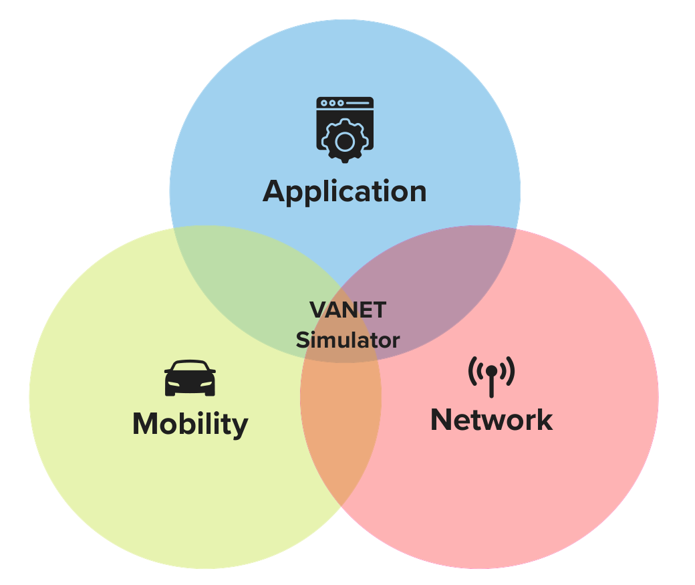
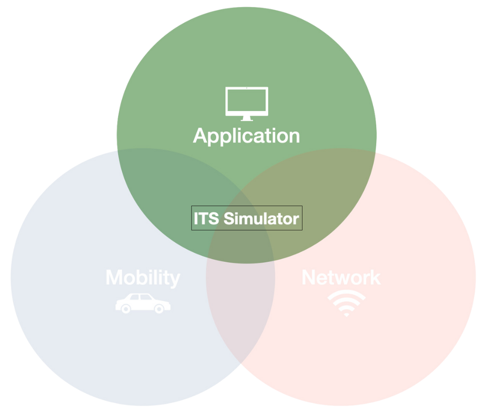

# Conceptual Decisions 

Disolv is an agent-based model with Discrete-time based progression.
A typical VANET simulator can be imagined to be a combination of high-fidelity mobility and network simulators.
The problem under study constitutes the application.
Together, the architecture looks as shown below:

  

This is how any VANET simulator such as Veins is modeled.

The primary goal of Disolv is to support large-scale evaluation of VANET studies.
As a result, all the design decisions of Disolv are oriented towards performance improvements when compared to state-of-the-art VANET simulators.
We morph the above simulator idea into an ITS simulator with applications taking the centre stage. 
There will be mobility and network components, but they are not the main focus of the modeling.
Hence, Disolv conceptually looks as shown below: 

  

How we reach from the VANET simulator to ITS simulator is the main focus of this section.
Several design aspects are incorporated to achieve this and we will look at them in detail.

- [Mobility](./design/mobility.md)
- [Links](./design/links.md)
- [Streams](./design/streams.md)
- [Messages](./design/messages.md)
- [Discrete-time](./design/discrete.md)